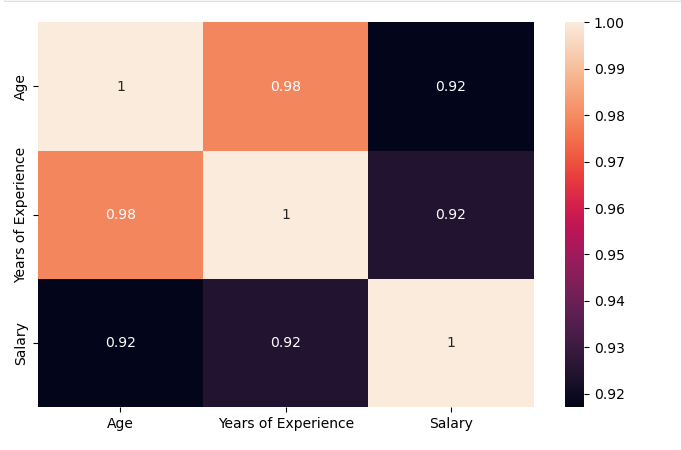
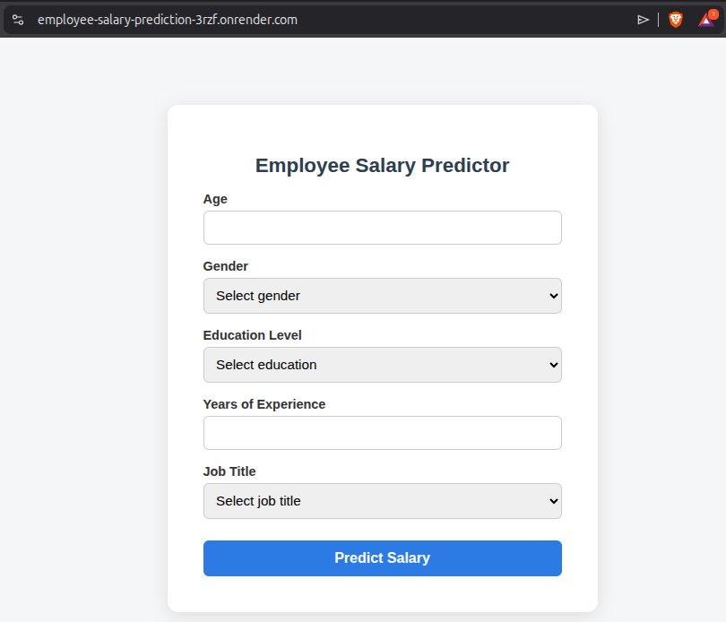
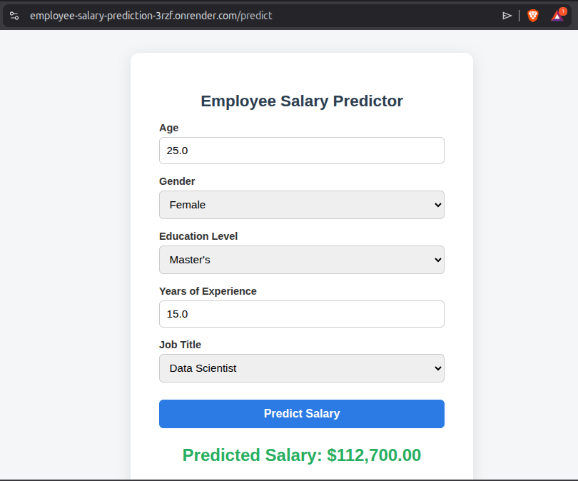

# Employee Salary Prediction

An end-to-end machine learning project that predicts employee salaries based on age, education level, job title, gender, and years of experience.

The project covers the complete workflow, including data cleaning, exploratory data analysis, feature engineering, model training, model evaluation, and deployment using Flask.

## Live Demo

https://employee-salary-prediction-3rzf.onrender.com/

> The application is hosted on Render's free tier. The first request may take a few seconds if the server is waking up.

---

## Screenshots

### Correlation Heatmap



### Home Page



### Prediction Result



---

## Dataset Features

- Age
- Gender
- Education Level
- Job Title
- Years of Experience

**Target**

- Salary

---

## Project Workflow

- Data Cleaning
- Missing Value Handling
- Duplicate Removal
- Outlier Investigation
- Exploratory Data Analysis
- Feature Encoding
- Feature Scaling
- Model Training
- Model Evaluation
- Hyperparameter Tuning
- Model Deployment

---

## Models Used

- Linear Regression
- K-Nearest Neighbors Regressor
- Decision Tree Regressor
- Random Forest Regressor
- Random Forest with GridSearchCV

Random Forest produced the best overall performance and was selected for deployment.

---

## Model Performance

| Metric | Value |
|---------|------:|
| R² Score | **0.89** |
| MAE | **9,907.79** |
| RMSE | **14,645.81** |

---

## Technologies Used

- Python
- Pandas
- NumPy
- Matplotlib
- Seaborn
- Scikit-learn
- Flask
- HTML
- CSS
- Joblib

---

## Project Structure

```text
employee-salary-prediction/
│
├── App/
│   ├── app.py
│   ├── static/
│   └── templates/
│
├── Data/Salary Data.csv
├── images/
│   ├── corr.png
│   ├── home.png
│   └── prediction.png
│
├── Models/
│   ├── RF_employees.pkl
│   ├── scaler.pkl
│   └── columns.pkl
│
├── Notebooks/Employee_Salary_Prediction.ipynb
│
├── requirements.txt
├── README.md
└── .gitignore
```

---

## Installation

```bash
git clone https://github.com/Lakshya-Saini-26/employee-salary-prediction.git

cd employee-salary-prediction

pip install -r requirements.txt

cd App

python app.py
```

Open:

```
http://127.0.0.1:5000
```

---

## Acknowledgements

The Flask frontend and deployment setup were developed with the assistance of AI tools. Data preprocessing, exploratory data analysis, model training, evaluation, and model selection were completed by me as part of my machine learning journey.

---

## Author

Lakshya Saini

B.Sc. Statistics Student

GitHub: https://github.com/Lakshya-Saini-26